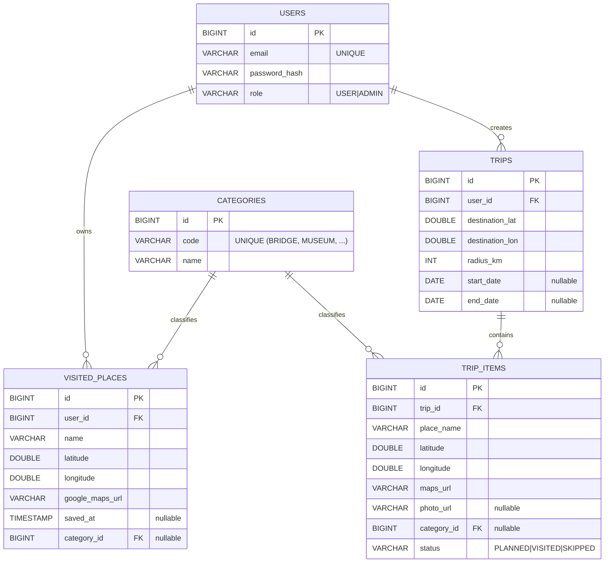

# mermaid2

```mermaid
erDiagram
  USERS ||--o{ VISITED_PLACES : owns
  USERS ||--o{ TRIPS : creates
  TRIPS ||--o{ TRIP_ITEMS : contains
  CATEGORIES ||--o{ VISITED_PLACES : classifies
  CATEGORIES ||--o{ TRIP_ITEMS : classifies

  USERS {
    BIGINT id PK
    VARCHAR email "UNIQUE"
    VARCHAR password_hash
    VARCHAR role "USER|ADMIN"
  }

  CATEGORIES {
    BIGINT id PK
    VARCHAR code "UNIQUE (BRIDGE, MUSEUM, ...)"
    VARCHAR name
  }

  VISITED_PLACES {
    BIGINT id PK
    BIGINT user_id FK
    VARCHAR name
    DOUBLE latitude
    DOUBLE longitude
    VARCHAR google_maps_url
    TIMESTAMP saved_at "nullable"
    BIGINT category_id FK "nullable"
  }

  TRIPS {
    BIGINT id PK
    BIGINT user_id FK
    DOUBLE destination_lat
    DOUBLE destination_lon
    INT radius_km
    DATE start_date "nullable"
    DATE end_date "nullable"
  }

  TRIP_ITEMS {
    BIGINT id PK
    BIGINT trip_id FK
    VARCHAR place_name
    DOUBLE latitude
    DOUBLE longitude
    VARCHAR maps_url
    VARCHAR photo_url "nullable"
    BIGINT category_id FK "nullable"
    VARCHAR status "PLANNED|VISITED|SKIPPED"
  }

```
